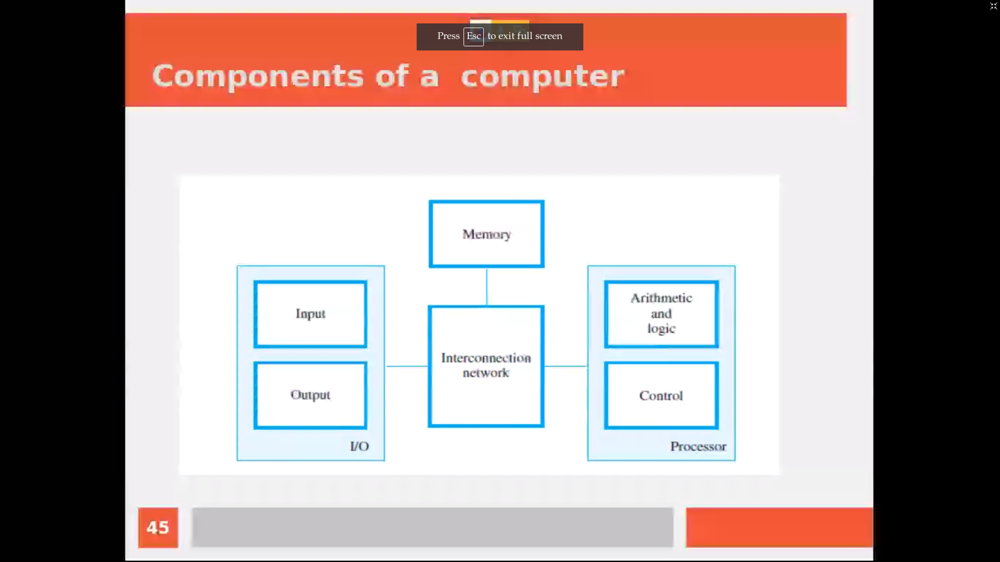

# Algorithmic Solutions for Problems
_(Lab - 3)_

The pdf of questions can be found [here](lab-3.pdf)

---

# Beginning with the Practicals  
  

## Some libries:
* Pandas
* NumPy
* TenserFlow
* SciPy
* OpenCV
* Sklearn

### Others:
* Request

_In CySec, python libraries can be used for packed encoding & decoding etc.._  
_Flask and Django etc.. are frameorks used to deploy_  
  
---

## Session 1:  History of comp. & brief by py

## Things Covered  
  
1. Scignificance of Computer  
2. Origin of Computer  
2. Why python  
2. Libraries in python
4. Signiificance of lib

## Sign...

## Origin

1. Abacus -> first computer (elaborate)
2. Pascalian(1673) and Leibntz comp  
    * had series of gates (elaborate)  
    * automatic 
    * but, expencive
    * non-programmable 
    * had to rearrange wheel every time of calculation
3. Charles Babbegge (1874) (Mathametician) 
    * analytical engin
    * earlier not had programming
    * further he worked and integrated 
    * used for maths calc (log etc..)
    * but, it was machenical comp
4. Herman Hollewer's machine 
    * 1890's
5. Eniac (elaborate)
    * John Maccaley and Peter's research 
    * research for eniac 
    * used vaccum tube
6. ABC Com

### Generation of comp..
  
(elaborate with example from the screen shot)

---

## Session 2 : Components and Arch.

## Components:

1. i/p unit
2. memory (primory & sec. mem)
3. o/p unit

### Input unit
* keyboard etc.

### Memory unit
* primory 
...  
..  
.  

**Diff. among CD and DVD**

## Softwares and types

1. Sysytem s/w
2. app s/w  

---

## Programming

#### what is prg.?  
def..  
  
#### Exercise

Regressing :  discrete o/p  
classifi : cont

## Session 3 : Number System

(101011100)_2

1*2^8 + 0*2^7 + 1*2^6 + 0*2^5 + 1*2^4 + 1*2^3 + 1*2^2 + 0*2^1 + 0*2^0

## Image types

b/w   ->  2 shades  
gray scale   ->  256  
    * intensity changes b/w #00 to #ff 
    * i.e. 00000000  ->  11111111
    * 2^8  --->  needs 8-bits
colored   
4th dim 

## List of conversion questions

class que

