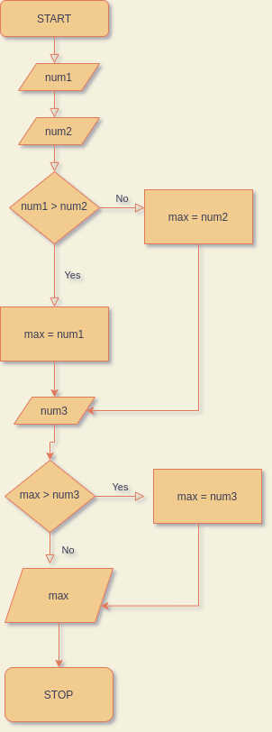
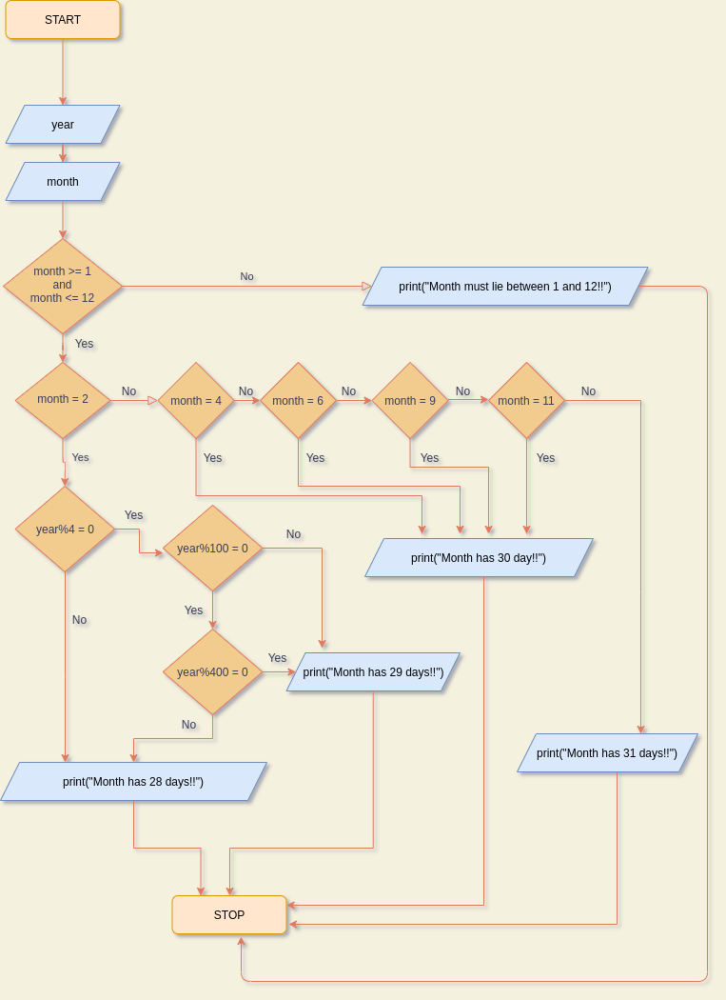

# Algorithmic Solutions for Problems
_(Lab - 3)_

The pdf of questions can be found [here](lab-3.pdf)

---

## Conditional Statments
### Sol. 1:
```
print("Enter 4 subjects' marks (one by one): ")
mark1 <- scan()
mark2 <- scan()
mark3 <- scan()
mark4 <- scan()
average <- (mark1 + mark2 + mark3 + mark4) / 4
if average < 50 then
    print("Failed :(!!")
else
    print("Passed :)!!")
endif
```

### Sol. 2:
```
print("Enter 3 cofficients (a, b, c): ")
a <- scan()
if a =/= 0 then
    b <- scan()
    c <- scan()
    b2m4ac <- bxb - 4xaxc
    if b2m4ac >= 0 then
        sqRoot <- sqrt(b2m4ac)
        root1 <- (-b + sqRoot)/2xa
        root2 <- (-b - sqRoot)/2xa
        print(root1)
        print(root2)
    else
        print("Problem has imaginary solutions")
    endif
else
    print("a can not be 0")
endif
```

### Sol. 3:
```
print("Enter num 1: ")
num1 <- scan()
print("Enter num 2: ")
num2 <- scan()
if num1 > num2 then
    max <- num1
else
    max <- num2
endif
print("Enter num 3: ")
num3 <- scan()
if num3 > max then
    max <- num3
endif
print("Maximum is: ",max)
```
**Flow Chart:-**  



### Sol. 4:
_**This is an assignment question!**_  
Input:
1. Year
2. Month Number (1-12)

```
START
print("Enter the year: ")
year <- scan()
print("Enter the month number (1-12)")
month <- scan()
if month>=1 and month<=12
    if month = 2 then
        if year%4 = 0 then
            if (year%100 is not 0 then) or (year%100 = 0 and year%400 = 0) then
                print("Month has 29 days")
            endif
        else
            print("Month has 28 days")
        endif
    else
        if ((month = 4) or (month = 6)) or ((month = 9) or (month = 11)) then
            print("Month has 30 days")
        else
            print("Month has 31 days")
        endif
    endif
else
    print("Month must lie between 1 and 12!!")
endif
STOP
```

**Flow Chart:-**  



---
## Looping Statments
While Loop
### Sol. 5:
```
// find 2^4
print("Enter the number: ")
num <- scan()
if num < 0 then
    print("Number must not be negative.")
else
    fact <- 1
    while num > 0 do
        fact <- fact x num
        num = num - 1
    end
    print(fact)
endif
```

### Sol. 6:
```
limit <- 50
num <- 2
while num <= limit then
    print(num)
    num <- num + 2
end
```
_also_

```
limit <- 50
num <- 1
while num <= limit do
    if num%2 = 0 then
        print(num)
    num <- num + 1
end
```

### Sol. 7:
```
print("Enter the num. of terms: ")
n <- scan()
a <- 0
b <- 1
if a=1 then
    print(a)
elseif
    print(a)
    print(b)
else
    n <- n - 2
    print(a)
    print(b)
    while n > 0 do
        c <- a + b
        print(c)
        n <- n - 1
        a <- b
        b <- c
    end
endif
```
