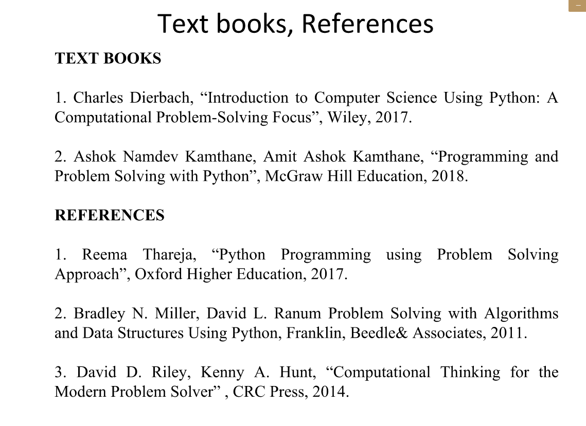

# Problem solving with Python
This is an introductory course of the Python language that aims to not only teach the programming language to a person, but develops a sense to transform any real world problem into a technical one that could be solved by computer programming!  
  
## Why Python?  
It's often asked that - _as a beginner, why nowadays we choose Python over some other traditional languages viz. C/C++ or Java when t comes to start with a programming language?_  
Well, there are a lot of the reasons behind the same. Let's have a look at a few of them below:  
_The **Python** -_
* has Simple Syntax
* is Widely Applicable
* is Beginner Friendly
* is a High Level Language
* has Good IDEs
* is Platform Independent
* is an Interpreted Language
* has a wide range of Libraries available
* programs Codes have relatively Short in length   
* has a huge Python Community etc...  
  
---
  
This course covers all the basic cum important aspects of the programming & and makes you understand the language from scratch!!  
  
Following are some prescribed books/resources for that can be helpful for both i.e. who are beginners and who already have some experience of the Python language!   

  
  
## Let's Start from Scratch...  
<!--
\<li'l brefing\>  
\<discuss the syllabus\>  
\<Links to the complete syllabus as in the whole repo\>  
-->  
Here are the links to the notes from basics:  
* [Module 1](notes/Module1.md)  
  
_Fork this repo. to learn or to make any correction!!_

---

## Footnote  
The above course is a part of the M.Sc. Computer Science, offered by Indian Institute of Information Technology & Management - Kerala in the year 2020.  
This syllabus/course may vary with the curriculum.  

---

