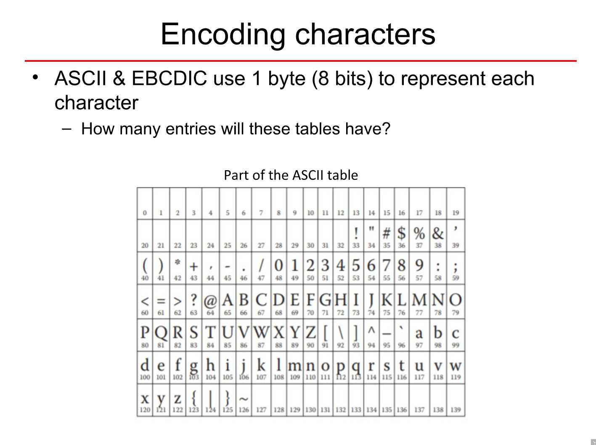
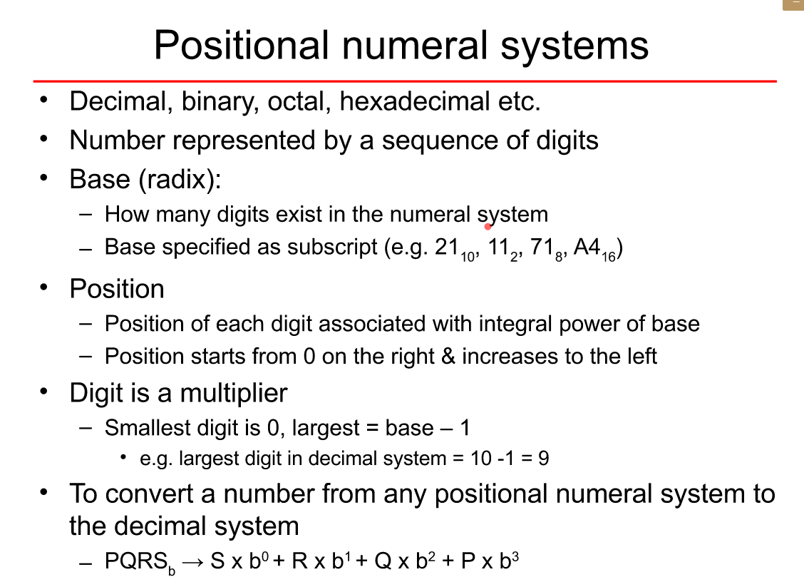
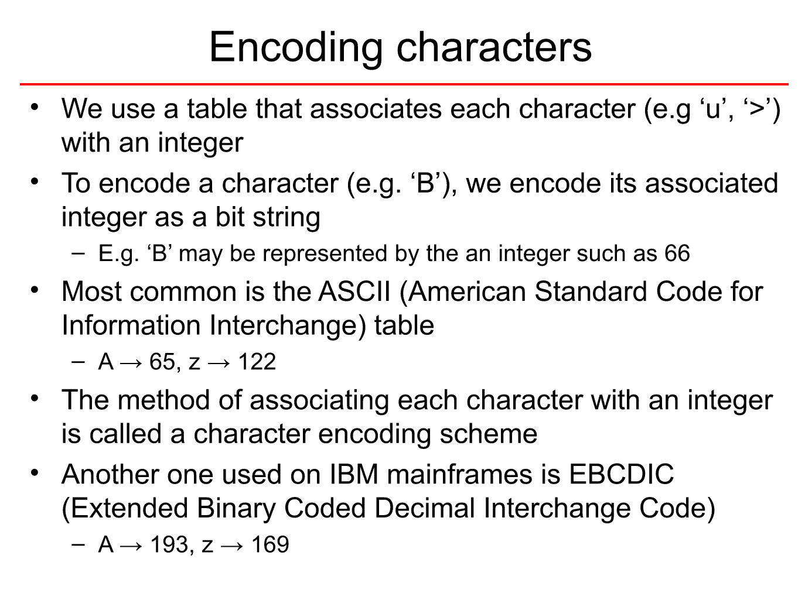
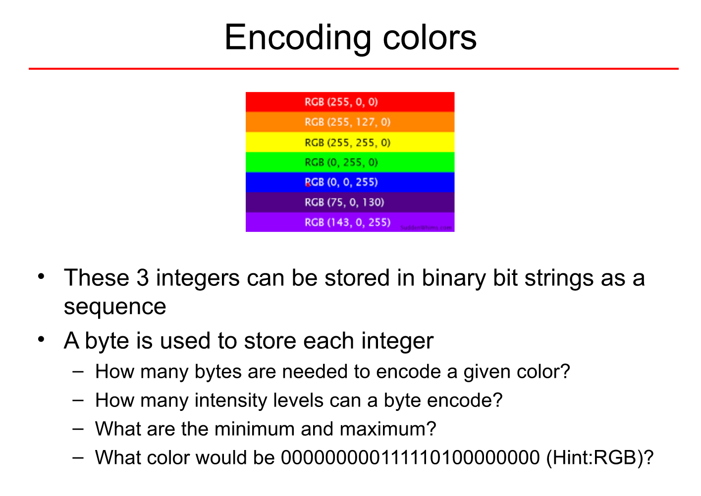
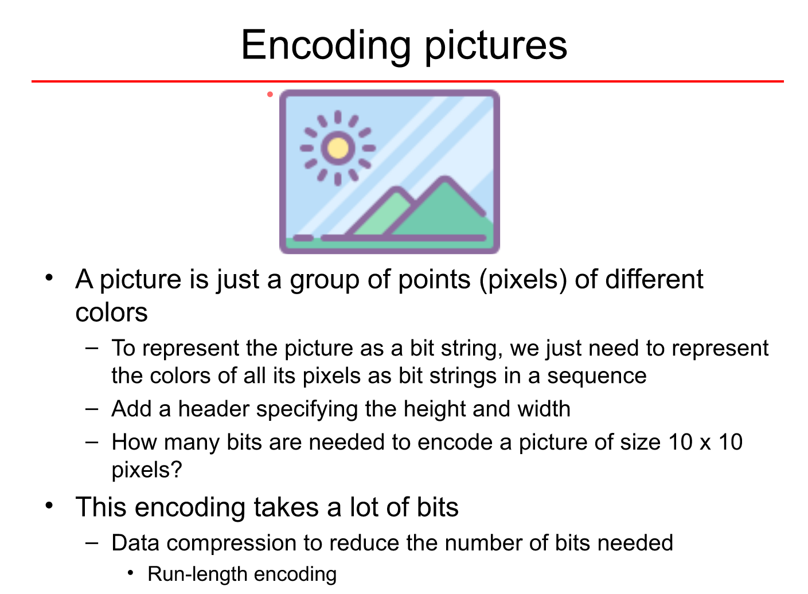
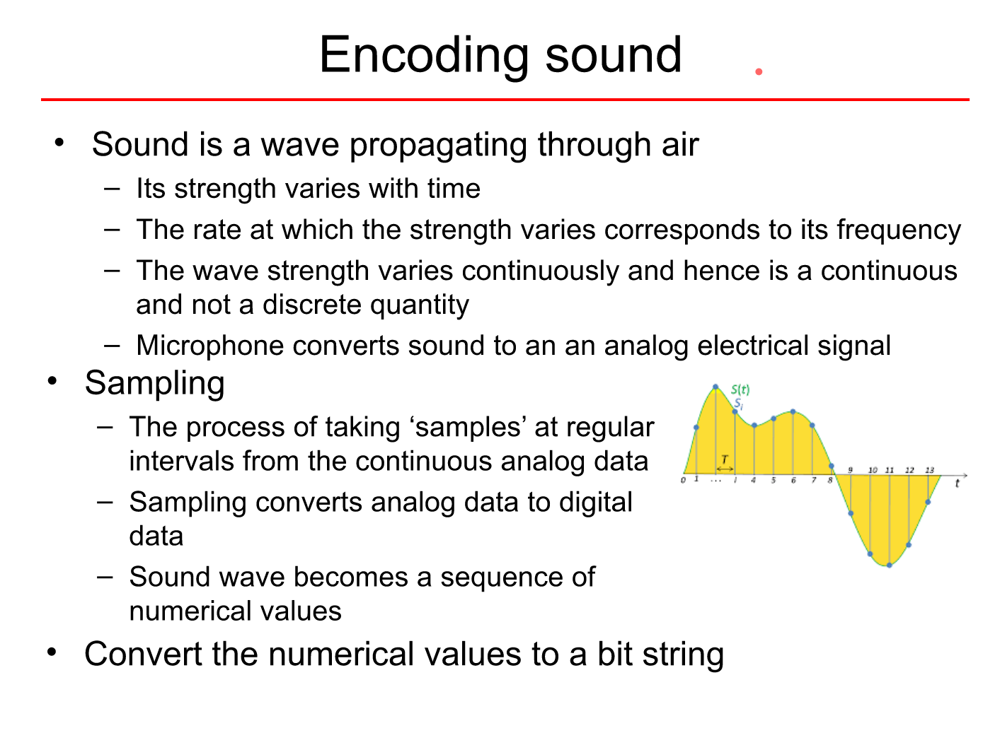

# The Begining  

### Remember!
1. Can follow any book that covers syllabus  
2. Don't follow websites untill they ain't trusted

## Table of Content  

### 1. Topics:  
> - Information & Data  
> - Analog & Digital System  
> - Bits, Bytes & Bit Patterns  
> - Numeral Systems  
> - Data Encoding  

### 2. Pre-Requisites:  
> - Basic Maths

---

## Information & Data

**Information:** A fact/piece of knowledge about real world  
**Data:** Representation of Information in a format that can be stored processed by the computers  
  
_The data has no meaning on its own, alone!_  
  
eg.:
 1. A _credit card number_ or someone's _name_ is a piece of an information
 2. When CC no. or name is used for some specific purpos, it becomes data (as actually data element is stored on the CC using magnetically charged particles)

### Information can be:  
  
1. Encoded  
2. Quantified  
  
  
#### Encoding  
> _Converting information into **Data**_
  
#### Quantifiable Info:  
  
1. **Continuous:**
> * Can go infinite
> * Can be fractional, too
> * Associates with Physical Measurement  
> * eg.: height, weight  
  
1. **Discrete:**
> * These are finite i.e. countable
> * Non-Fractional (integers only)
> * Associates with Physical Measurement  
> * eg.: number of days in a month  
  
---

## Analog & Digital System

### 1. Analog  
**- Encodes** real world info **as continuous**  
* eg.: Conversion of song into continuously varying electric signal by mic  
    
**- Operats** on **Continuous** data  
* eg.: Amplifier - amplifies and sends the signal to the speaker

### 2. Digital  
* **Encodes real world info** (both continuous & discrete) into **Discrete** data  
* **Operates** on **Discrete** data  
* **Digital** system **preferred** over Analog  
* **Mordern Comp.** are good example

## Bits, Bytes & Bit Patterns

### Bits:  
The term _Bit_ comes from _**Bi**nary Digi**t**_.  
As it's understood that a **binary** itself deals with _two_. Hence, there is only the scope of either of the 2 values i.e. **zero** (0) & **one** (1).  
  
Hence formally, a 0 or 1 is considered as a **bit** in the binary number system. Usually we represent a the term _bit_ by a lower case 'b' _(b)_.  
_Some times these values also represent 'True & False', or 'On & Off'!_  

A **group of 4** such **bits** is termed as a _**Nibble**_.  

### Byte:  
A group of _2-nibbles_ or **8-bits** is called a _**Byte**_. It is represented by an upper case 'b' _(B)_.  

### Bit-Strings or Bit-Patterns:  
A sequece of bits can be used to represent different numbers or data. To do so, we often group the different number of the bits.  
Here are few terms for the the set of bits of different length:   

_210 = 1,024_  

| Data Measurement    |	Size |  
| --------------------- |   ---- |  
| 1 Bit |   Single **Bi**nary Digi**t** (1 or 0) |  
| 1 Byte    |	8 bits |  
| 1 Kilobyte (KB)   |   1,024 Bytes |  
| 1 Megabyte (MB)   |   1,024 Kilobytes |  
| 1 Gigabyte (GB)   |   1,024 Megabytes |  
| 1 Terabyte (TB)   |   1,024 Gigabytes |  
| 1 Petabyte (PB)   |   1,024 Terabytes |  
| 1 Exabyte (EB)    |   1,024 Petabytes |   
  
## Numeral Systems  
There are so many ways to represent the data numerically that are know as Numaral Systems. For eg.: Decimal Binary, Roman etc...  
**Roman:** I, II, III, IV ....  
**Decimal:** {0,1,2,3,4,5,6,7,8,9}  
**Binary:** {0,1}  
**Octal:** {0,1,2,3,4,5,6,7}  
**Hexadecimal:** {0,1,2,3,4,5,6,7,8,9,A,B,C,D,E,F} ...  
  
  
  
  
We use different set of collection of bits to repreasent it as a different number system eg.:  
> * the _**binary number** system can only accomadate_ 21 = 2 unique values i.e. **zero** (0) & **one** (1).   
> * the _**octal number** system can accomadate_ 23 = 8 unique values i.e. ranging between 0-7 i.e. **{000, 111}**.    
> * the _**hexadecimal number** system can accomadate_ 24 = 19 unique values i.e. ranging between 0-F i.e. **{000, FFF}**.    
  
### Positional Numeral System   
A positional (numeral) system is a system for **representation of numbers by an ordered set** of numerals symbols (called _digits_) in which the value of a numeral symbol depends on its position. _For each position a unique symbol or a limited set of symbols is used._  
  

### Conversion  
We are often interested to convert the values from one to another number system. The above mentioned formula can be used to convert the them. These coversions can be for the following types:   
1. Binary to Decimal   
2. Binary to Octal   
3. Binary to Hex   
4. Decimal to Binary   
5. Hex to Binary etc..  
  
### Covnersion of Real Number
Example of **bin to dec** REAL number conversion  
eg.: _42.31 = 2x100 + 4x101 + 3x10-1 + 1x10-2_  
   
## Data Encoding
The different formant of data is needed to be encoded ultimately in either of the 0 & 1. The data can be of various types as well. So, mostly we have to deal with following encodings:  
> * Character Encoding  
>   
> * Color Encoding  
> There are basically 4 main colours whose intensity can lead to all the different shaades.
>   
> * Image Encoding  
> Generally the images are classified in 4 types based on their shades. Main 3 are given below:  
>   a) Black and White (#00 or #ff)  
>   b) Gray Scale (#00 to #ff)  
>   c) Coloured (#000000 or #ffffff)   
>   
> * Sound Encoding  
>   
  
---

## Some Other Common Issues  
We deal with some other issues too while converting the data from one form to another.  As -  

#### Approximation & Precision  
* These are used when the calculation does not end up with any significant result.  

#### Errors  
* **Overflow:**  
When the number of resultent bits exceed the length accomodated  
eg.: _1 + 255 to store in a 8-bit num_  
* **Underflow:**  
When the number of resultent number is too small to fit into the length allowed  
eg.: _0.001 / 255_  
  
---  
